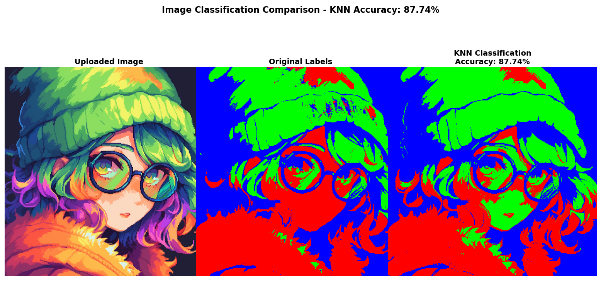
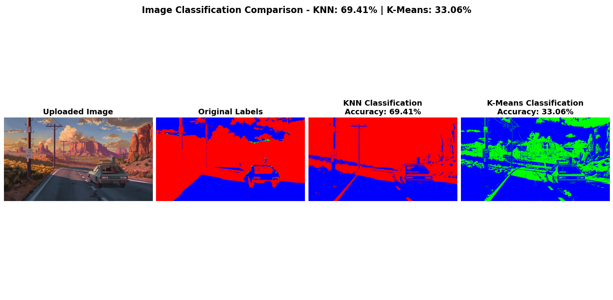
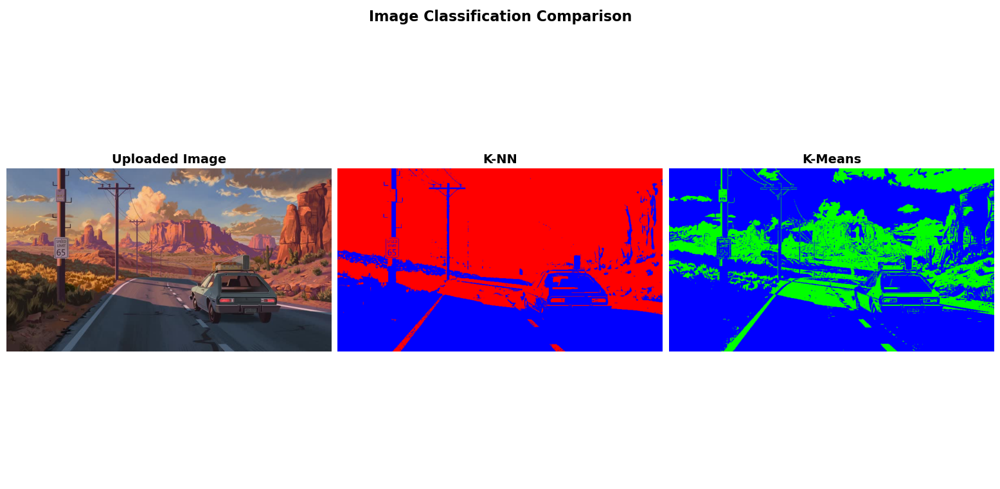
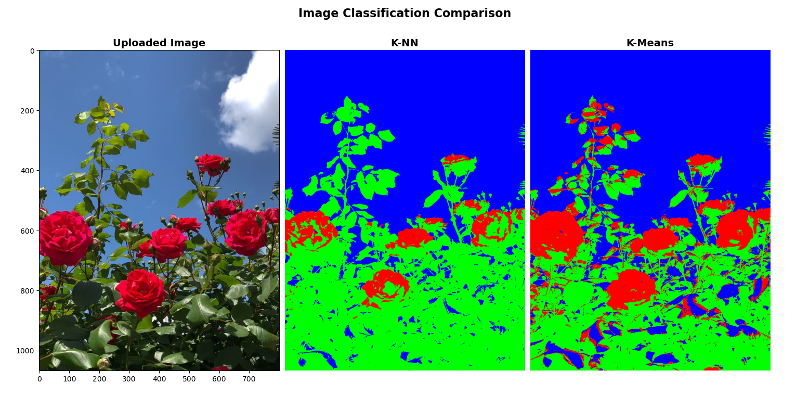

# KNN & K-Means Pixel Classifier

A machine learning project that compares supervised (KNN) and unsupervised (K-Means) classification techniques for pixel-based image segmentation.

## Author
**Mabrouki Ala Eddin**  
TP Machine Learning - Master 1 IA  
Université de Tamanrasset  
Supervisor: M. TAFFAR

## Overview
This project implements a K-Nearest Neighbors (KNN) classifier to segment images based on RGB color values. Each pixel is classified into one of three categories: red, green, or blue, based on its dominant color component.

## Test Results
- k-nn = 5, train-size = 25 pixe
- k-means = 3, iterations = 10





## Usage
### Clone
```bash
git clone https://github.com/roikaa/knn-kmeans-pixel-classifier.git 
```
```bash
cd knn-kmeans-pixel-classifier
```
### install dependencis
nix/nixos:
```bash
nix-shell
```
pip:
```bash
pip install numpy pillow matplotlib scikit-learn
```
### Run program
```bash
python classification.py
```

